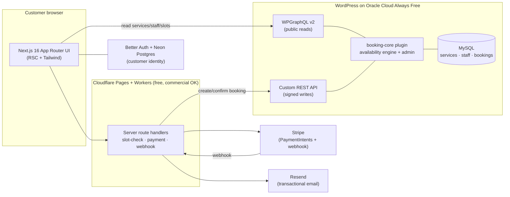
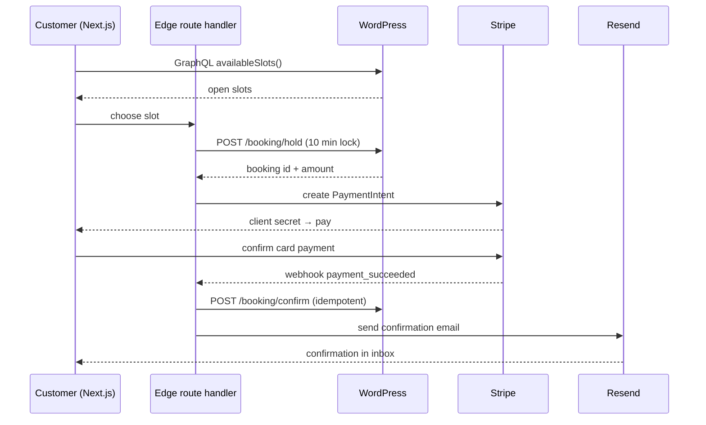

# BookingApp — Project Plan

**Type:** Headless WordPress + Next.js appointment booking app
**Domain:** Appointments / services (time-slot based — staff, service duration, open slots)
**Build budget:** Free tier now, paid upgrade later
**Plan date:** 2026-06-15
**Stack snapshot:** Next.js 16 (App Router) · WordPress + WPGraphQL v2 · Cloudflare Pages · Oracle Cloud Always Free · Stripe · Resend · Better Auth

---

## 1. Goal & MVP scope

Build a customer-facing booking site where visitors pick a service, see real open time-slots for the right staff member, pay a deposit (or full price), and get a confirmation email. The business owner manages services, staff, hours, and bookings from the WordPress admin.

**MVP must-haves (confirmed):**

- **Online payments** — Stripe, deposit or full amount at booking time.
- **User accounts / auth** — customers log in to view and manage their bookings.
- **Email notifications** — confirmation + reminder emails.
- **Admin dashboard** — owner manages services, staff, availability, and views/edits bookings.

**Explicitly out of MVP** (Phase 2+): multi-location, recurring appointments, gift cards, SMS reminders, reviews, marketing automation, multi-language.

---

## 2. Architecture at a glance

WordPress is the **system of record and admin UI**. Next.js is the **customer-facing frontend and payment orchestrator**. They talk over HTTP: reads via GraphQL, writes via signed REST.



**Why this split:** WordPress admin gives the owner a free, familiar dashboard with zero custom UI to build, and the booking data lives where staff/services live. Next.js owns the fast public experience and holds the Stripe secret key server-side at the edge. Reads use GraphQL for precise, cacheable queries; writes use a small signed REST surface so booking creation stays controlled and idempotent.

---

## 3. Recommended free-tier stack

| Layer | Pick | Free-tier reality | Why this one |
|---|---|---|---|
| Frontend framework | **Next.js 16** (App Router, RSC, Turbopack) | Free, OSS | Current LTS is 16.2.x; RSC-first cuts client JS, great SEO ([release](https://endoflife.date/nextjs)) |
| Styling | **Tailwind CSS 4.x** | Free, OSS | Fast, tokens, dark-mode-first |
| Frontend host | **Cloudflare Pages** | Commercial use allowed, unlimited bandwidth, 500 builds/mo, Workers 100K req/day ([pricing](https://www.devtoolreviews.com/reviews/cloudflare-pages-pricing-bandwidth-limits-2026)) | The only major free host that permits a revenue app — see §4 |
| CMS / backend | **WordPress** + WPGraphQL v2 + ACF + WPGraphQL for ACF | Free, OSS | Plays to your WP/PHP strength; WPGraphQL v2 adds persisted queries + cache directives ([2026 guide](https://forminit.com/blog/headless-wordpress-2026-guide/)) |
| Backend host | **Oracle Cloud Always Free** (Ampere ARM VM) | 2 OCPU / 12 GB RAM as of 2026-06-15, 10 TB egress, never expires ([details](https://cloudpricecheck.com/free-tier/oracle)) | Persistent free server that runs WP + MySQL comfortably |
| Customer identity | **Better Auth** (+ Neon Postgres free) | Free, OSS | Auth.js maintainers now steer new projects here ([LogRocket](https://blog.logrocket.com/best-auth-library-nextjs-2026/)) |
| Payments | **Stripe** | Test mode free; live = per-transaction fee only, no monthly | Industry standard, clean PaymentIntent + webhook flow |
| Email | **Resend** | 3,000 emails/mo free, transactional, React templates ([compare](https://www.brevo.com/blog/best-email-api/)) | Best DX with Next.js; Brevo (300/day) is the higher-volume alt |
| Local dev | **wp-env / Docker** + Git + GitHub | Free | Reproducible WP locally before deploying to Oracle |
| CDN / DNS / SSL | **Cloudflare** (in front of WP too) | Free | Caches GraphQL, hides origin, free certs |

---

## 4. The hosting decision (read this before deploying)

**Vercel's free Hobby tier forbids commercial use.** A booking app that takes payments is commercial, so going live on Hobby would violate Vercel's terms and risk the app being paused. Hobby is fine for personal dev previews only.

So the free-tier frontend host is **Cloudflare Pages**, which explicitly permits commercial projects on the free plan.

| Host / tier | Price/mo | Limits | Commercial use? | Best for |
|---|---|---|---|---|
| **Cloudflare Pages — Free** | $0 | Unlimited bandwidth, 500 builds/mo, Workers 100K req/day | **Yes** | Free production booking app *(recommended)* |
| Vercel — Hobby | $0 | 100 GB transfer, 1M function calls | **No — personal only** | Dev previews, side projects |
| Vercel — Pro | $20/user | Higher caps, overages allowed | Yes | If you want Vercel DX in production later |
| Netlify — Free | $0 | 100 GB bandwidth, 300 build-min/mo | Yes (limited) | Smaller challenger; tighter build minutes |

*Prices as of 2026-06. Sources: [Cloudflare](https://www.devtoolreviews.com/reviews/cloudflare-pages-pricing-bandwidth-limits-2026), [Vercel Hobby terms](https://deploywise.dev/blog/vercel-free-tier-limits-2026).*

**Recommendation:** Build and deploy on Cloudflare Pages. If you later prefer Vercel's DX, the same Next.js code moves over for $20/mo.

---

## 5. WordPress data model

Defined by a custom plugin (`booking-core`). Use ACF for editor-friendly fields; store bookings in a **custom DB table** (not a CPT) for fast slot queries and clean relational rows.

| Entity | Storage | Key fields |
|---|---|---|
| **Service** | CPT `service` + ACF | title, description, duration (min), buffer (min), price, deposit %, assigned staff, active |
| **Staff** | CPT `staff` + ACF | name, bio, photo, services offered, working hours (per weekday), time off / blackout dates |
| **Booking** | Custom table `wp_bookings` | id, service_id, staff_id, customer_email, customer_user_id, start_utc, end_utc, status (`held` / `confirmed` / `cancelled`), stripe_payment_intent, amount, created_at |
| **Availability** | Computed, not stored | open slots = staff working hours − existing bookings − buffers − blackout |
| **Settings** | ACF options page | timezone, currency, min notice, max advance days, deposit policy |

**Availability engine** is the core logic: given a service + staff + date, generate candidate slots from working hours stepped by service duration, then subtract anything overlapping a `held`/`confirmed` booking plus buffers. Store everything in **UTC**; convert to the customer's timezone in the UI.

---

## 6. API design

**Reads — WPGraphQL v2 (public, cacheable):**

- `services` — list with duration, price, staff.
- `staff` — list with services offered.
- `availableSlots(serviceId, staffId, date)` — custom GraphQL field backed by the availability engine.

**Writes — custom signed REST (server-to-server from Next.js only):**

- `POST /booking/hold` — locks a slot for ~10 min (status `held`, returns booking id + amount). Prevents double-booking.
- `POST /booking/confirm` — marks `confirmed` after Stripe success (idempotent on payment_intent).
- `POST /booking/cancel` — releases a slot.

Writes are authenticated with a shared HMAC secret (or short-lived JWT) so only the Next.js edge can create bookings — never the public browser. A DB **unique constraint on (staff_id, start_utc)** is the final guard against races.

---

## 7. Booking + payment flow



The **hold-then-confirm** pattern with a short TTL is what keeps two people from grabbing the same 2:00 PM slot. If payment never completes, the hold expires and the slot frees automatically.

---

## 8. Authentication approach

**Recommended: Better Auth + Neon Postgres (free).** Auth.js v5 still works, but its own maintainers now direct new projects to Better Auth, so a fresh 2026 build should start there. Identity lives in Next.js; bookings reference the customer by email + user id, while WordPress stays the booking system of record.

**Trade-off to decide:**

- **Better Auth + Neon** *(recommended)* — best DX, decoupled, scales independently. Cost: a second free database to operate.
- **WordPress users + JWT** — one backend, everything in WP MySQL. Cost: clunkier auth DX on the Next.js side.

Pick Better Auth unless you specifically want a single backend; the decision is documented so it's easy to revisit.

---

## 9. Project structure

**Next.js frontend** (`/frontend`):

```
frontend/
├── app/
│   ├── (marketing)/page.tsx          # home / services list
│   ├── book/[serviceId]/page.tsx     # slot picker + checkout
│   ├── account/                      # customer bookings (auth-gated)
│   └── api/
│       ├── booking/route.ts          # hold/confirm proxy to WP
│       └── stripe/webhook/route.ts   # payment_succeeded handler
├── lib/
│   ├── wp.ts                         # GraphQL client
│   ├── auth.ts                       # Better Auth config
│   └── stripe.ts
├── components/                        # UI (RSC-first, 'use client' only when needed)
└── env.ts                            # typed env vars
```

**WordPress plugin** (`/wp-content/plugins/booking-core`):

```
booking-core/
├── booking-core.php                  # bootstrap, hooks
├── includes/
│   ├── post-types.php                # service, staff CPTs
│   ├── availability.php              # slot engine
│   ├── rest-controller.php           # hold/confirm/cancel
│   ├── graphql.php                   # WPGraphQL field registration
│   └── db.php                        # wp_bookings table (dbDelta)
├── admin/
│   └── bookings-page.php             # admin list/edit view
└── uninstall.php
```

Structure follows your WP plugin conventions (assets/includes/admin), with all input sanitized/validated/escaped and nonce + capability checks on admin actions.

---

## 10. Phased roadmap

| Phase | Outcome | Key work |
|---|---|---|
| **0 — Setup** | Local + cloud foundations | wp-env locally; provision Oracle VM; install WP + WPGraphQL + ACF; scaffold Next.js 16 on Cloudflare Pages; Git repo |
| **1 — Core MVP** | Bookable, paid, confirmed | `booking-core` plugin (CPTs, slot engine, bookings table); GraphQL reads; slot picker UI; hold/confirm REST; Stripe; Resend confirmation |
| **2 — Accounts + admin** | Self-service + management | Better Auth; customer account area; admin bookings screen; reminder emails; cancel/reschedule |
| **3 — Polish + scale** | Production-ready | Caching (Redis object cache, persisted GraphQL queries, CDN); a11y pass (WCAG 2.2 AA); rate limiting; error monitoring; load test |

---

## 11. Free → paid upgrade path

| Trigger | Free now | Upgrade to | Approx cost |
|---|---|---|---|
| Frontend traffic > 100K req/day | Cloudflare Pages free | Cloudflare Workers Paid | $5/mo |
| Prefer Vercel DX | Cloudflare Pages | Vercel Pro | $20/user/mo |
| WP needs more power / managed | Oracle Always Free | Oracle PAYG or Kinsta/WP Engine headless | $5–30+/mo |
| Email > 3,000/mo | Resend free | Resend paid (50K) | $20/mo |
| Identity DB grows | Neon free | Neon paid | from ~$19/mo |
| Payments | Stripe test | Stripe live | per-transaction only |

The architecture doesn't change when you upgrade — you swap a plan, not the code.

---

## 12. Key risks & mitigations

- **Oracle reclaims idle Always Free compute.** A booking backend with low early traffic could be flagged idle. *Mitigation:* monitoring/keep-alive; or convert to Pay-As-You-Go (stays ~$0 at low usage) to make the instance non-reclaimable. Note the A1 limit dropped to 2 OCPU/12 GB on 2026-06-15 — provision within the new shape.
- **Double-booking races.** *Mitigation:* hold-with-TTL + DB unique constraint on (staff, start_utc) + idempotent confirm.
- **WP on a small VM under load.** *Mitigation:* full-page + object cache, persisted GraphQL queries, Cloudflare CDN in front; WP only serves cache-misses and writes.
- **Vercel Hobby ToS.** *Mitigation:* host production on Cloudflare Pages (commercial-friendly) — already chosen.
- **Auth library churn.** *Mitigation:* Better Auth for the new build; auth logic isolated in `lib/auth.ts` so it's swappable.
- **Timezone bugs.** *Mitigation:* store UTC everywhere, convert only at the UI edge.
- **Secrets exposure.** *Mitigation:* Stripe secret + WP write-HMAC live only in edge env vars, never shipped to the browser.

---

## 13. Open decisions & next step

**Decisions to confirm before Phase 1:**

1. Auth: Better Auth + Neon (recommended) vs WP JWT single-backend.
2. Payment policy: deposit % or full payment at booking.
3. Backend now: provision Oracle this week, or start fully local (wp-env) and deploy backend in Phase 0's second half.

**Recommended next step:** scaffold Phase 0 — initialize the Next.js 16 app + `booking-core` plugin skeleton + local WP in this repo, so Phase 1 can start against a running stack.

---

*Sources: [Next.js version](https://endoflife.date/nextjs) · [Vercel free tier](https://deploywise.dev/blog/vercel-free-tier-limits-2026) · [Cloudflare Pages](https://www.devtoolreviews.com/reviews/cloudflare-pages-pricing-bandwidth-limits-2026) · [Oracle Always Free](https://cloudpricecheck.com/free-tier/oracle) · [Resend/Brevo](https://www.brevo.com/blog/best-email-api/) · [Headless WP 2026](https://forminit.com/blog/headless-wordpress-2026-guide/) · [Auth.js → Better Auth](https://blog.logrocket.com/best-auth-library-nextjs-2026/)*
